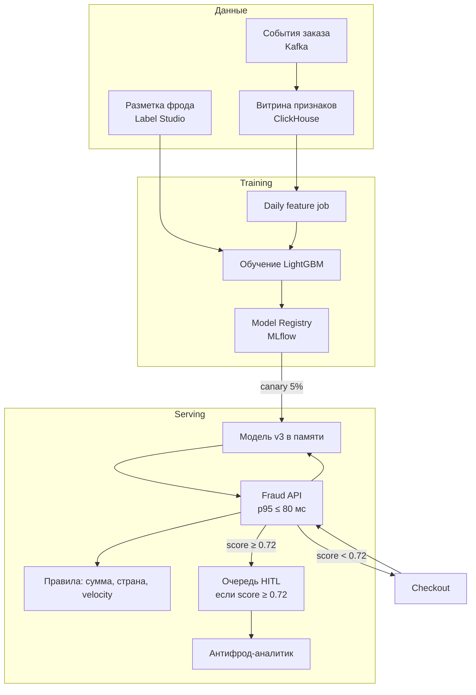

# Пример диаграммы Mermaid

Синтаксис для раздела 4.1 design doc. В VS Code / Cursor откройте превью Markdown: блок ниже должен отрисоваться как схема.

Это **пример синтаксиса**, а не универсальная архитектура. В проекте замените компоненты на свои (иначе схема не пройдёт проверку на специфичность).

Альтернатива: тот же код в файле `diagrams/architecture.mmd` и ссылка из §4.1.

## Как читать

- два потока на одной схеме: **serving** (онлайн-запрос) и **training** (батч до реестра);
- есть деталь кейса, которую нельзя перенести в чужой проект без правок: порог 0.72, HITL, LightGBM, Kafka → ClickHouse;
- подписи на стрелках — контракт или условие, не декорация.

Документация: [https://mermaid.js.org/syntax/flowchart.html](https://mermaid.js.org/syntax/flowchart.html)
